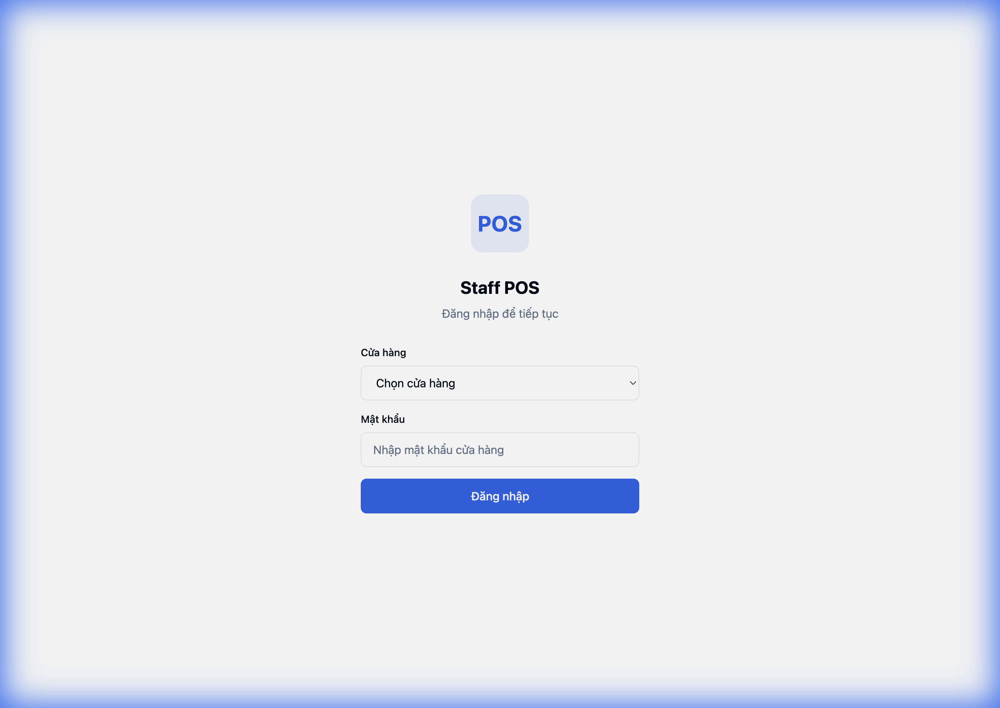

# Staff POS Frontend - Bootstrap Walkthrough

## Summary

Đã bootstrap thành công project Staff POS Frontend với đầy đủ:

- Vite + React + TypeScript
- TailwindCSS + shadcn/ui styling
- Zustand auth store
- Axios với 401 interceptor
- Route protection
- Bottom navigation

---

## Project Structure

```
src/
├── api/
│   └── axios.ts           # Axios instance + 401 interceptor + retry
├── components/
│   ├── auth/
│   │   └── ProtectedRoute.tsx
│   └── layout/
│       ├── AppLayout.tsx
│       └── BottomNav.tsx
├── lib/
│   └── utils.ts           # cn() utility
├── pages/
│   ├── LoginPage.tsx
│   ├── HomePage.tsx
│   ├── TransactionPage.tsx
│   └── DashboardPage.tsx
├── stores/
│   └── authStore.ts       # Zustand store
├── types/
│   └── index.ts
├── App.tsx                # Router + bootstrap
├── main.tsx
└── index.css
```

---

## Key Features

| Feature                     | Status |
| --------------------------- | ------ |
| Vite + React + TS           | ✅     |
| TailwindCSS + shadcn colors | ✅     |
| Axios + 401 interceptor     | ✅     |
| Retry 3 times               | ✅     |
| Zustand auth store          | ✅     |
| `/me` bootstrap logic       | ✅     |
| Route protection            | ✅     |
| Role-based tabs (hidden)    | ✅     |
| Mobile-first layout         | ✅     |

---

## Verification

✅ Dev server chạy thành công tại `http://localhost:5173`



---

## Next Steps

> [!NOTE]
> Project bootstrap hoàn tất. **Chờ instruction tiếp theo** như đã yêu cầu.
